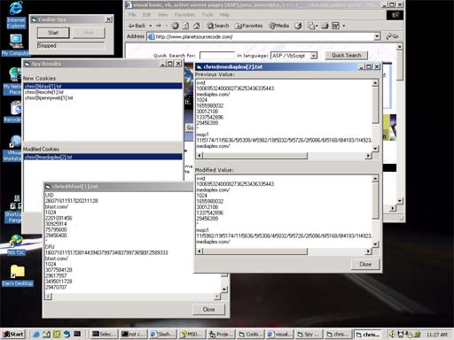



## IE Cookie Spy

### Description

This program allows the user to monitor cookies while browsing the internet. It shows new cookies and modified cookies, and allows the user to view the details of each cookie, including previous values and modified values. Its useful for debugging web applications where cookies are involved, among other purposes.
 
### More Info
 
In the top of modMain, Change the CONST "Cookiedir" to point to your cookie directory. Works with IE.

             |
---                |---
**Submitted On**   |2002-02-05 15:57:16
**By**             |[Chris Bradford](https://github.com/Planet-Source-Code/PSCIndex/blob/master/ByAuthor/chris-bradford.md)
**Level**          |Intermediate
**User Rating**    |4.7 (14 globes from 3 users)
**Compatibility**  |VB 6\.0
**Category**       |[Complete Applications](https://github.com/Planet-Source-Code/PSCIndex/blob/master/ByCategory/complete-applications__1-27.md)
**World**          |[Visual Basic](https://github.com/Planet-Source-Code/PSCIndex/blob/master/ByWorld/visual-basic.md)
**Archive File**   |[IE\_Cookie\_53655272002\.zip](https://github.com/Planet-Source-Code/chris-bradford-ie-cookie-spy__1-31578/archive/master.zip)

